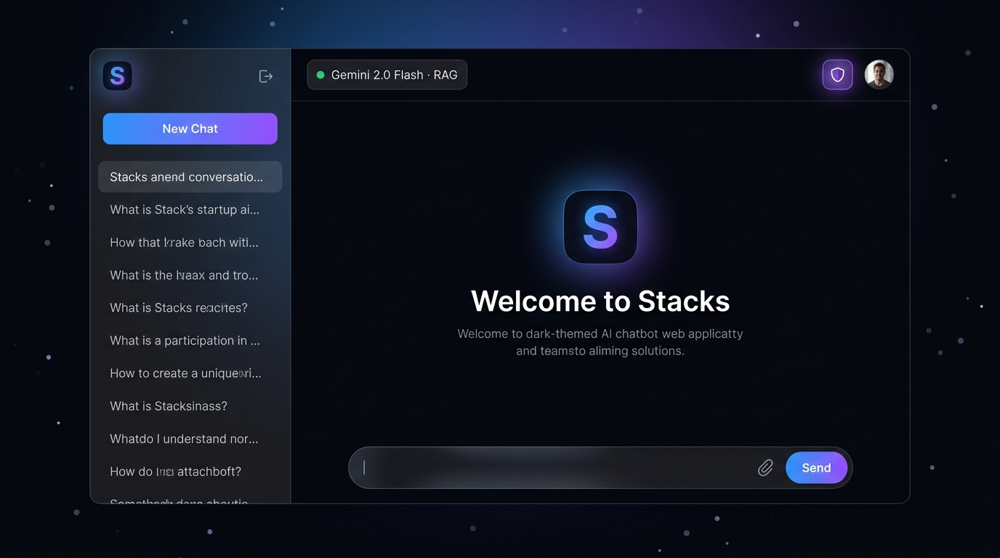
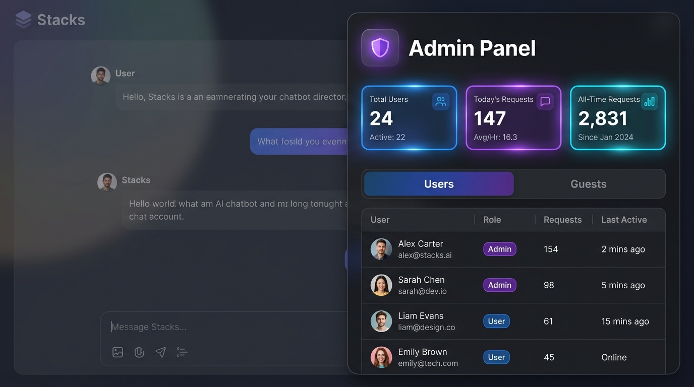

<div align="center">

<svg xmlns="http://www.w3.org/2000/svg" width="64" height="64" viewBox="0 0 32 32" fill="none">
  <rect width="32" height="32" rx="8" fill="#080A0E"/>
  <rect x="6" y="18" width="20" height="4" rx="2" fill="#7C3AED" opacity="0.6"/>
  <rect x="6" y="13" width="20" height="4" rx="2" fill="#00E5D0" opacity="0.8"/>
  <rect x="6" y="8" width="20" height="4" rx="2" fill="#00E5D0"/>
</svg>

# Stacks

**A private, document-grounded RAG chatbot.**  
Upload a document. Ask it anything. Get grounded answers — or an honest "I don't know."

[](https://nodejs.org)
[](https://react.dev)
[](https://ai.google.dev)
[](https://qdrant.tech)
[](https://mongodb.com)
[](LICENSE)

</div>

---

## 🖼️ Preview

<div align="center">
  
  <p><em>Premium glassmorphism UI with React Three Fiber shader backgrounds</em></p>
  <br/>
  
  <p><em>Comprehensive admin panel for user and query analytics</em></p>
</div>

---

## What it does

Stacks lets you interrogate your own documents in a private chat interface. Upload a PDF, DOCX, or plain text file, ask natural-language questions, and get answers drawn directly from the document's content.

- **Honest by default** — if the answer isn't in the document, Stacks says so. It never hallucinates.
- **Premium Glassmorphism UI** — features deep space blacks, electric accents, liquid glass cards, and a custom WebGL React Three Fiber shader gradient background.
- **Dynamic Model Selection** — switch seamlessly between Gemini models via the UI dropdown, or let it auto-select based on load.
- **Admin Dashboard** — monitor system stats, view request logs, promote users to admin, and track both authenticated and guest usage.
- **Guest mode** — works instantly without signing up. Sessions are ephemeral.
- **Conversation history** — sign in to save, rename, and delete past conversations.
- **Google Sign-In** — one-click auth alongside the classic email/password flow.
- **Model fallback** — automatically downgrades to a lighter Gemini model under high demand, so the app stays responsive instead of returning errors.

---

## Tech stack

| Layer | Technology |
|---|---|
| **Frontend** | React + Vite, vanilla CSS modules, Framer Motion, `@react-three/fiber` |
| **Backend** | Node.js + Express (ESM), `--watch` dev mode |
| **AI / Embeddings** | Gemini API (`gemini-3.x-flash` + `gemini-embedding-001`) |
| **Vector store** | Qdrant Cloud (or local via Docker) |
| **Database** | MongoDB Atlas (or local) — users, request logs, history |
| **Auth** | Email/password (bcrypt + express-session) + Google OAuth 2.0 |

---

## Prerequisites

| Requirement | Notes |
|---|---|
| Node.js ≥ 20 | `node --watch` is used in dev mode |
| [Gemini API key](https://aistudio.google.com/apikey) | Free tier is sufficient to start |
| [Qdrant](https://qdrant.tech) | Cloud (free tier) **or** local via Docker (see below) |
| [MongoDB](https://mongodb.com/atlas) | Atlas free M0 tier **or** local |

---

## Quick start

### 1 — Clone and install

```bash
git clone https://github.com/your-username/stacks-rag-chatbot.git
cd stacks-rag-chatbot

# Install server dependencies
cd server && npm install

# Install client dependencies
cd ../client && npm install
```

### 2 — Configure the server

```bash
cp server/.env.example server/.env
```

Open `server/.env` and fill in:

```env
# Required — get a free key at https://aistudio.google.com/apikey
GEMINI_API_KEY=

# Required — Qdrant Cloud cluster URL + API key
QDRANT_URL=https://your-cluster.cloud.qdrant.io
QDRANT_API_KEY=

# Required — MongoDB connection string
MONGODB_URI=mongodb+srv://...

# Required — generate with: node -e "require('crypto').randomBytes(32).toString('hex')|console.log"
SESSION_SECRET=

# Optional — only needed if you want Google Sign-In
GOOGLE_CLIENT_ID=
GOOGLE_CLIENT_SECRET=
GOOGLE_CALLBACK_URL=http://localhost:3001/api/auth/google/callback
```

### 3 — Start the app

Open two terminals:

```bash
# Terminal 1 — backend (auto-restarts on file changes)
cd server && npm run dev

# Terminal 2 — frontend (Vite HMR)
cd client && npm run dev
```

Open **http://localhost:5173** — you're done.

---

## Running Qdrant locally (Docker)

If you don't want a Qdrant Cloud account, run it locally:

```bash
docker compose up -d
```

Then set in `server/.env`:

```env
QDRANT_URL=http://localhost:6333
QDRANT_API_KEY=
```

---

## Google Sign-In setup (optional)

1. Go to [Google Cloud Console → Credentials](https://console.cloud.google.com/apis/credentials)
2. Create an **OAuth 2.0 Client ID** → **Web Application**
3. Add an authorized redirect URI: `http://localhost:3001/api/auth/google/callback`
4. Paste the Client ID and Secret into `server/.env`

Without these values the Google button gracefully returns a `501` — the rest of the app is unaffected.

---

## API reference

All endpoints are prefixed `/api`.

### Auth — `/api/auth`

| Method | Path | Body | Description |
|---|---|---|---|
| `POST` | `/register` | `{ username, email, password }` | Create a new account |
| `POST` | `/login` | `{ identifier, password }` | Sign in (identifier = email or username) |
| `POST` | `/logout` | — | Sign out, clear session |
| `GET` | `/me` | — | Returns the current user or `null` |
| `PATCH`| `/profile` | `{ displayName }` | Update user display name |

### Google OAuth — `/api/auth/google`

| Method | Path | Description |
|---|---|---|
| `GET` | `/` | Redirect to Google consent screen |
| `GET` | `/callback` | OAuth callback — sets session, redirects to client |

### Sessions — `/api/session`

| Method | Path | Auth | Description |
|---|---|---|---|
| `POST` | `/new` | — | Create a new ephemeral chat session, returns `sessionId` |
| `GET` | `/:sessionId/status` | — | Document status for a session |
| `GET` | `/history` | ✅ | List saved conversations |
| `GET` | `/history/:sessionId` | ✅ | Full message history for one conversation |
| `PATCH` | `/history/:sessionId` | ✅ | Rename a conversation |
| `DELETE` | `/history/:sessionId` | ✅ | Delete a conversation |

### Admin — `/api/admin`

| Method | Path | Auth | Description |
|---|---|---|---|
| `GET` | `/stats` | 👑 | System metrics and request statistics |
| `GET` | `/users` | 👑 | List all registered users |
| `GET` | `/guests`| 👑 | List active guest sessions |
| `POST`| `/users/:id/toggle-admin` | 👑 | Grant or revoke admin privileges |

### Upload — `/api/upload`

| Method | Path | Body | Description |
|---|---|---|---|
| `POST` | `/` | `multipart/form-data` — `file` + `sessionId` | Index a document (PDF, DOCX, TXT — max 20 MB) |

### Chat — `/api/chat`

| Method | Path | Body | Description |
|---|---|---|---|
| `POST` | `/` | `{ sessionId, message, model }` | Send a message, returns `{ reply }` |

---

## License

MIT — see [LICENSE](LICENSE).